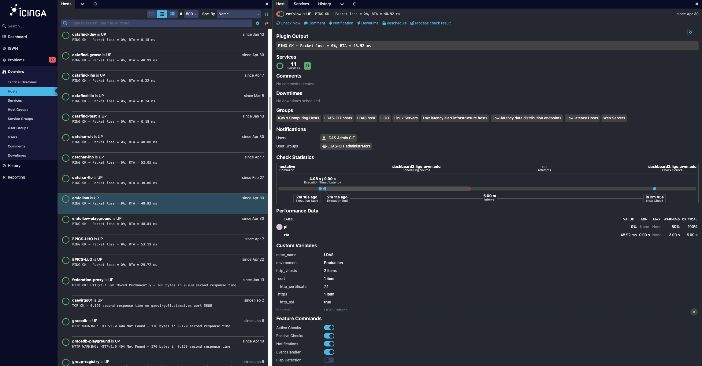

.. highlight:: shell-session

Monitoring and Management
=========================

To ensure the smooth and continuous operation of gwcelery, constant monitoring
of the various systems is paramount.

Monitoring Responsibilities
---------------------------

There is a weeklong rotating position among gwcelery librarians involving
active monitoring and management of gwcelery, with the following explicit
responsibilities:

1.  Handle emergency or urgent issues identified via email, mattermost_, or
    Sentry_. Respond to issues in a timely manner, especially when other
    librarians may not be available

2.  Follow up on Nagios issues, restarting gwcelery instances if this would
    resolve them

3.  Handle new releases, both creation and following up on `active SCCB issues`_

4.  Handle `active issues`_, especially in those latest milestones_

5.  Dig through `stale issues`_, assigning, bumping, or working on

6.  Check on security updates

GWCelery supports a rich selection of management and monitoring tools. Here is
an introduction to a few of them. For more Celery monitoring solutions, see the
:doc:`Celery monitoring and management guide <celery:userguide/monitoring>`.

Flower
------

Flower_ is a dashboard for monitoring Celery tasks.
It provides a good first look to check if everything is running as expected.
Any offline worker will be show in red. By clicking on a failed worker or task,
one can get some details about the failure reason. Flower does not store the results
persistently (Sentry is a better tool to look at historical data).

The production instance is available at
https://emfollow.ligo.caltech.edu/flower/.

To start Flower for
monitoring during local development, run the following command and then
navigate to http://localhost:5555/ in your browser::

    $ gwcelery flower

Sentry
------

All warnings, errors, exceptions, and tasks failures are both logged to disk
and uploaded instantly to Sentry_, an error monitoring and reporting platform.
Sentry notifies GWCelery contributors by email when a new bug occurs.

Sentry monitoring of the production instance of GWCelery is available
`here <https://ligo-caltech.sentry.io/issues/?environment=production&project=1425216&referrer=sidebar>`__.
Other environments (i.e. playground or test) can be chosen from the top bar, as well as the
monitoring period.

By clicking on a specific issue one can get more details about the issue itself, including the
code snippet generating the problem.
On the right sidebar of the specific issue page,
there is the possibility to automatically open a corresponding issue in the LIGO
GitLab instance.

.. image:: _static/sentry-screenshot.png
   :alt: Screenshot of Sentry

For details about the Sentry logging configuration, see the
:mod:`gwcelery.sentry` module or the `Celery integration module`_ in the Sentry
SDK docs.

Nagios
------

.. note::
   The GWCelery Nagios plugin is tailored to GWCelery and is not sufficiently
   general to use with other Celery applications.

The dashboard.igwn.org_ service uses Nagios_ to monitor
and report on the health of all of the components of the low-latency analysis
infrastructure.

The status of the host running the production instance of GWCelery can be
found under *Overview* then *Hosts* in the left side menu (select the *emfollow* entry).
From the host information page, the links to the GWCelery service status or
to the alert history and other useful monitoring pages can be found in the top
left of the page.

Moreover, GWCelery provides the command ``gwcelery nagios`` to check the status of the
application and provide a report in `the format that Nagios expects`_.

You can run it manually from the command line::

    $ gwcelery nagios
    OK: GWCelery is running normally

To configure Nagios itself, see the `Nagios configuration overview`_, or if
GWCelery and Nagios are running on different hosts, the `Nagios Remote Plugin
Executor (NRPE) documentation`_.

Ganglia
-------

Ganglia is used to to view either live or recorded statistics covering metrics such as:
CPU, memory, disk, network or network utilization.

The machine running the production instance of GWCelery is monitored
`here <https://ldas-gridmon.ligo.caltech.edu/ganglia/?r=hour&cs=&ce=&m=load_one&c=Servers&h=emfollow.ldas.cit&tab=m&vn=&tz=&hide-hf=false&mc=2&z=medium&metric_group=ALLGROUPS>`__.

From the top bar the monitoring period can be chosen, ranging form 1 hour to 1 year.

Munin
-----

Minin provides similar information as Ganglia. The machine running the production instance of GWCelery is monitored
`here <https://ldas-gridmon.ligo.caltech.edu/munin/ldas.cit/emfollow.ldas.cit/>`__.

Metrics (i.e. disk or network utilization, processes etc.) are displayed by day or by week.

Flask
-----

GWCelery includes a Flask_ web application that provides forms to manually
initiate certain tasks.

To start Flask for monitoring during local development, run the following
command and then navigate to http://localhost:5000/ in your browser::

    $ gwcelery flask run

Command-Line Tools
------------------

All Celery application provide :ref:`command-line monitoring and management
utilities <celery:monitoring-control>`, including the following:

*   ``gwcelery shell``: Start an interactive Python or IPython interpreter for
    interacting with Celery. All tasks as well as the :obj:`~gwcelery.app`
    application instance are automatically imported and available as globals.
    Example::

        $ gwcelery shell
        Python 3.6.6 (default, Jun 28 2018, 05:43:53)
        Type 'copyright', 'credits' or 'license' for more information
        IPython 6.5.0 -- An enhanced Interactive Python. Type '?' for help.

        In [1]: download.s('coinc.xml', 'M6757').delay().get()

*   ``gwcelery call``: Call a task from the command line by passing it arguments
    in JSON format. The output is the unique identifier of the result.
    Example::

        $ gwcelery call gwcelery.tasks.gracedb.download --args='["coinc.xml", "M6757"]'
        d11099e7-75e5-4aa3-800b-b122b667757c

*   ``gwcelery result``: Get the result of a previously called task. Example::

        $ gwcelery result ab4aa6d7-9f21-420c-8401-cbe6863cf7dc
        (b'<?xml version=\'1.0\' encoding=\'utf-8\'?>\n<!DOCTYPE LIGO_LW SYSTEM "htt'
         b'p://ldas-sw.ligo.caltech.edu/doc/ligolwAPI/html/ligolw_dtd.txt">\n<LIGO_L'
         ...
         b'\t</Stream>\n\t</Table>\n</LIGO_LW>\n')

*   ``gwcelery events``: A text UI monitoring tool that offers functionality
    similar to Flower. Example::

        $ gwcelery events

    .. image:: _static/celeryevent-screenshot.png
       :alt: Screenshot of celeryevent text UI monitor

.. _active SCCB issues: https://git.ligo.org/computing/sccb/-/issues/?sort=updated_asc&state=opened&search=gwcelery&first_page_size=100
.. _active issues: https://git.ligo.org/emfollow/gwcelery/-/issues/?sort=updated_desc&state=opened&first_page_size=100
.. _milestones: https://git.ligo.org/groups/emfollow/-/milestones?search_title=GWCelery&state=&sort=
.. _stale issues: https://git.ligo.org/emfollow/gwcelery/-/issues/?sort=updated_asc&state=opened&first_page_size=100
.. _Flower: https://flower.readthedocs.io/
.. _dashboard.igwn.org: https://dashboard.igwn.org/
.. _mattermost: https://chat.ligo.org/ligo/channels/emfollow
.. _monitor.ligo.org: https://monitor.ligo.org/
.. _Nagios: https://www.nagios.com
.. _the format that Nagios expects: https://assets.nagios.com/downloads/nagioscore/docs/nagioscore/3/en/pluginapi.html
.. _Nagios configuration overview: https://assets.nagios.com/downloads/nagioscore/docs/nagioscore/4/en/config.html
.. _Nagios Remote Plugin Executor (NRPE) documentation: https://assets.nagios.com/downloads/nagioscore/docs/nrpe/NRPE.pdf
.. _Sentry: https://sentry.io/
.. _`on premise`: https://docs.sentry.io/server/
.. _`Celery integration module`: https://docs.sentry.io/platforms/python/celery/
