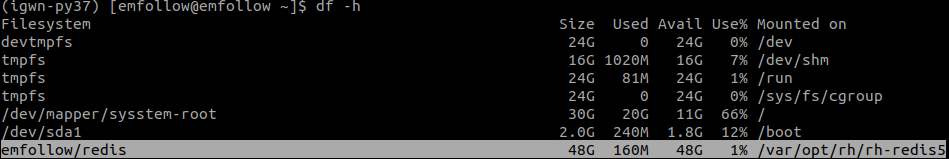
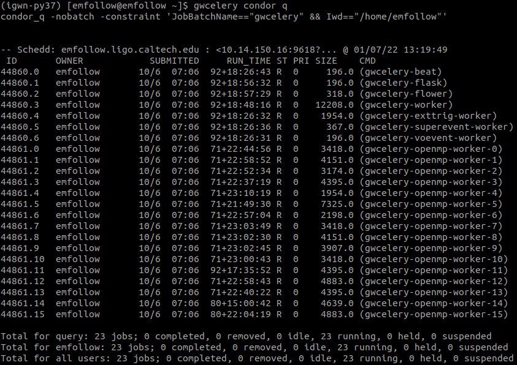
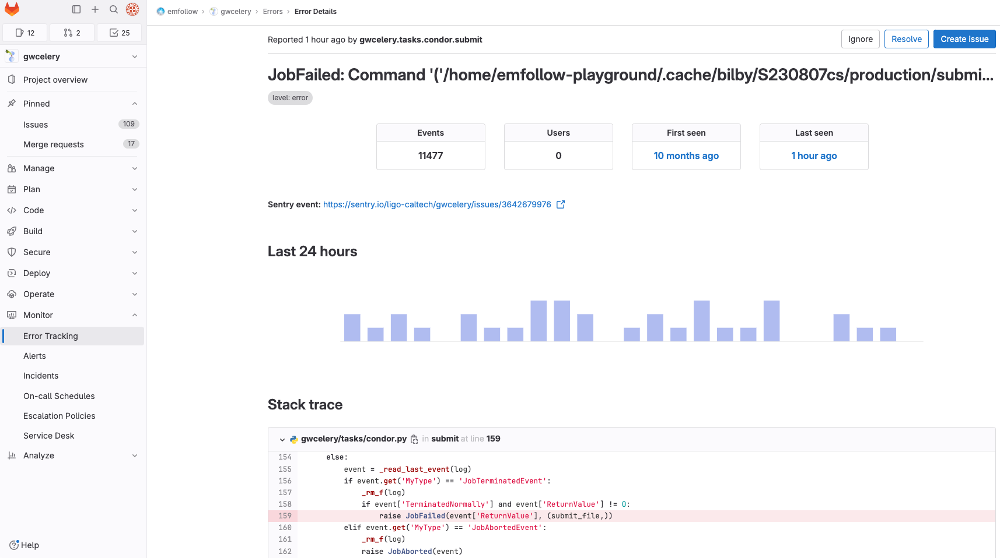
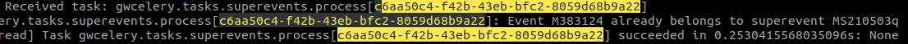

Operations
==========

These instructions are suitable for operating GWCelery in a *production* environment
and are meant to give precise instructions to the on-call people on how to fulfill the requested tasks.

Preliminary steps
-----------------

#. In order to perform some of the operations listed below, you need to be able to login to
   the ``emfollow.ligo.caltech.edu`` machine. To be granted permission, please send an e-mail to
   the low-latency chairs `listed in the EM-follow wiki <https://wiki.ligo.org/Bursts/EMFollow/WebHome>`_.
   See the `list of users who can access the shared account <https://ldg.ligo.org/ldg/sharedaccounts/emfollow/>`_.

#. Some critical operations, like manually restarting GWCelery or removing HTCondor jobs,
   require you to login to that machine as the privileged user ``emfollow``. These operations are
   reserved to experts. In case you need to be able to login as privileged user, please send a mail
   to the low-latency chairs.

#. To login to the ``emfollow`` machine, you need to provide a public SSH key by 
   `registering your SSH key <https://ldg.ligo.org/ldg/manage_ssh/>`_.

Monitor the pipeline
--------------------

Different tools are available to monitor the *production* instance of GWCelery. They are described
in the :doc:`Monitoring <./monitoring>` section.

In particular, to monitor the GWCelery application we suggest to use:

#. `Flower <https://emfollow.ligo.caltech.edu/flower/>`_ to see the status of task execution in real time
   (it has a retention period of few hours).

#. `Sentry <https://ligo-caltech.sentry.io/issues/?environment=production&project=1425216>`_ to monitor the
   occurence of warnings, errors, and exeptions in task execution. It has practically unlimited retention period and sends
   e-mail notifications in case of a new issue. You can login with Google using your *ligo.org* credentials.

To monitor the ``emfollow.ligo.caltech.edu`` machine:

#. `Nagios <https://dashboard.igwn.org/>`_ to check if the host is up and running.

#. `Ganglia <https://ldas-gridmon.ligo.caltech.edu/ganglia/?c=Servers&h=emfollow.ldas.cit>`_ to monitor metrics
   such as CPU, memory or network utilization.

Additionally, disk space issues may occur if the Redis database grows too large and fills up the entire disk.
The disk space occupancy can be checked with::

   $ ssh albert.einstein@emfollow.ligo.caltech.edu
   $ df -h

Monitor the HTCondor queue
--------------------------

You need to login to the ``emfollow.ligo.caltech.edu`` machine as a privileged user::

   $ ssh emfollow@emfollow.ligo.caltech.edu

and run the command::

   $ gwcelery condor q  

The sixth column of the ouput gives you the status of each job, which can have the following values:

#. R = running

#. H =  on hold

#. I = idle (waiting for a machine to execute on)

#. C = completed

#. X = removed

#. S = suspended (execution of a running job temporarily suspended on execute node)

#. < = transferring input (or queued to do so)

#.  > = transferring output (or queued to do so).

The last output column is the name of the worker, which needs to be reported to the experts in case of a job not in running state.
To better understand why a job is not in a running state, you can use the command::

   $ condor_q <job-id> -analyze
 

Monitor the workflow execution
------------------------------

In order to be able to understand if the alert generation workflow is executing correctly, we suggest to look at the 
:doc:`gwcelery.tasks.orchestrator` section, 
describing the inner workings of the Orchestrator, as well as to have some training session side by side with a GWCelery expert.

Diagnose issues
---------------

.. rubric:: Sentry

When a new issue appears in Sentry, make a first analysis of the problem by looking at the issue details,
which also include the lines of code generating the problem.
Each issue should be linked to a GitLab ticket and assigned either to you or to some expert colleague
to be identified during the low-latency technical call.

The procedure to open a ticket starting from a Sentry issue is the following:

#. From the `GWCelery GitLab`_ project, navigate to *Monitor > Error Tracking* from the right side menu.
#. Select the issue you are interested in.
#. Click on *Create issue* on the top right of the issue detail page.

Long standing issues that do not yet have a fix can be marked as *Ignored*, after having been assigned a ticket,
not to create confusion in the dashboard.

Fixed issues have to be marked as *Resolved*, with a reference to the MR that is supposed to have implemented the fix.
A resolved issue that reappears, is marked by Sentry as *Regression*.

.. rubric:: Log files

If more information is needed to undertsand the root cause of an issue, you can inspect the GWCelery logs.
For this, you need to login to the ``emfollow.ligo.caltech.edu`` machine as unprivileged user and go to the ``emfollow`` home directory::

   $ ssh albert.einstein@emfollow.ligo.caltech.edu
   $ cd /home/emfollow

Log files exist per worker basis. The file *gwcelery-worker.log* is for the general worker and is usually the largest
(can be several hundred MBs, even up to a GB).
It can provide important information based on timestamps.

Within the GWCelery code, tasks may have a *log.info* or *log.warning* statement, which could provide insight into the state of
an event or superevent during the time of failure.
Also, every task in Celery has a UUID identifier, which could be used to understand whether a specific task completed, failed or is taking too long.

Restart the pipeline
--------------------

.. danger::
   Tasks to be executed only by an _expert_ or under her supervision.
   Note that the deployed version is from a specific commit/tag. DON'T perform git operations like git pull/git checkout that can change this.

GWCelery should be started/stopped using GitLab's continuous deployment, as explained in the :doc:`deployment` section. 

Alternatively, the deployment pipeline can be triggered manually by navigating to :menuselection:`Build --> Pipelines` on the right side menu of the `GWCelery GitLab`_ repository.
For this, you need to know which instance of the pipeline needs to be retriggered, so expert supervision is needed.

In case of problems with GitLab, the pipleine can be manually started/stopped in the following way:

#. login to the ``emfollow`` machine::

   $ ssh emfollow@emfollow.ligo.caltech.edu

   (There is a confirmation page, respond *Yes*.)

   .. image:: _static/emfollow-login.png
      :alt: Confirmation page for the emfollow.ligo.caltech.edu machine.

#. remove the HTCondor jobs::

   $ gwcelery condor rm

   Some jobs might refuse to be removed gracefully. Check this with::

      $ gwcelery condor q

   If there are workers stuck with an *X* status. Remove them with::

      $ condor_rm -forcex <job-id>

#. Resubmit the deployment that was running with::
 
      $ gwcelery condor submit

.. _`GWCelery GitLab`: https://git.ligo.org/emfollow/gwcelery
